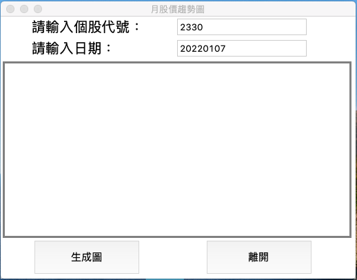
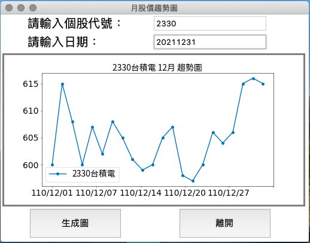

# tkinter_with_stock_line


## crawler
```python
crawStock()
```
- 目標網站：
     - www.twse.com
- 目標資料：
     - 日收盤價
- 趨勢線圖呈現

     可能需要事先下載字體
     
     ```
     # 下載台北思源黑體並命名taipei_sans_tc_beta.ttf
     !wget -O TaipeiSansTCBeta-Regular.ttf
     ```

## tkinter 
```
main()
```

>  生成前



>  生成後



